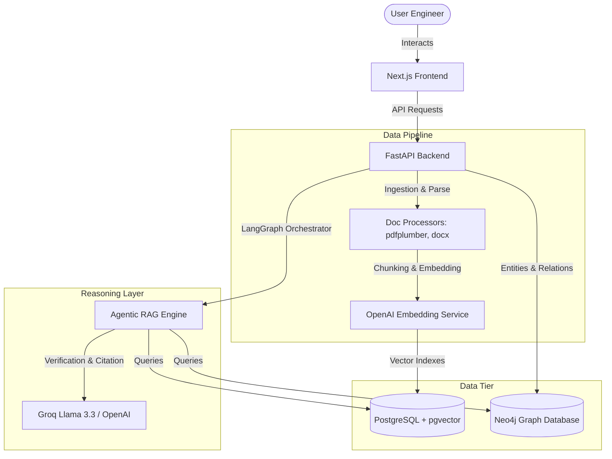

# System Architecture Document

This document describes the high-level architecture, directory layout, and design decisions for the **Industrial Knowledge Intelligence Platform**.

## 1. High-Level Architecture Diagram
The system contains three major components: Frontend presentation, FastAPI Backend orchestration, and Dual-database storage (Postgres with pgvector + Neo4j Graph DB).

## 2. Directory Responsibilities

### Root Directory
- `/backend`: Holds FastAPI application code, dependencies, and testing configurations.
- `/frontend`: Next.js web application, styles, components, and hooks.
- `/database`: Relational database schemas, migrations (Alembic), and Neo4j initialization scripts.
- `/infrastructure`: Docker configurations for dev and production containers.
- `/docs`: Architecture design files, APIs, and roadmap documentation.

### Backend Application (/backend/app)
- `api/`: API Routers and endpoints grouped by version (v1).
- `core/`: Core settings, configuration parsing, security, and main logging setup.
- `database/`: Database engine setup, sessions, and transaction lifecycles.
- `models/`: ORM entity declarations (SQLAlchemy).
- `repositories/`: Database query abstraction layer.
- `services/`: Business workflow orchestrators (Document Parsing, Graph Extraction, LangGraph agents).
- `schemas/`: Request/Response serialization structures (Pydantic).
- `middleware/`: Custom FastAPI middleware (CORS, timing, request tracing).
- `dependencies/`: Injection-ready database sessions, client instances, and user context.
- `exceptions/`: Domain-specific exceptions and handlers.
- `logging/`: Structured logging formatter.
- `utils/`: Reusable helpers (e.g. date formatting, cryptographic hashing).
- `workers/`: Background task queue workers (Celery/RQ).

### Frontend Application (/frontend)
- `app/`: Next.js App Router root layout and pages.
- `components/`: Pure visual layout elements (buttons, inputs, cards).
- `features/`: Complex page sections grouped by capability (e.g., GraphViewer, ChatInterface, DocBrowser).
- `hooks/`: Domain and lifecycle hooks.
- `lib/`: Initialization of shared clients (e.g. Fetch wrappers).
- `providers/`: Context wrappers (Theme, Toast, Chat state).
- `services/`: API layer communicating with the FastAPI backend.
- `styles/`: Global stylesheets and tailwind directives.
- `types/`: Domain models typed in TypeScript.
- `utils/`: Utility functions (date processing, string manipulation).

## 3. Database Design Decision

To achieve semantic understanding alongside structural relationship mapping, a **Dual-Database Strategy** is chosen:
1. **Relational + Vector (PostgreSQL with pgvector)**: Acts as the primary database storing document metadata, raw text chunks, and their high-dimensional vector embeddings. Ideal for semantic search and exact matching.
2. **Graph (Neo4j)**: Stores domain entities (Equipment, Locations, Protocols, Incident IDs) and their relationships (IS_PART_OF, LOCATED_IN, MAINTAINED_BY). Ideal for multi-hop structural reasoning.
